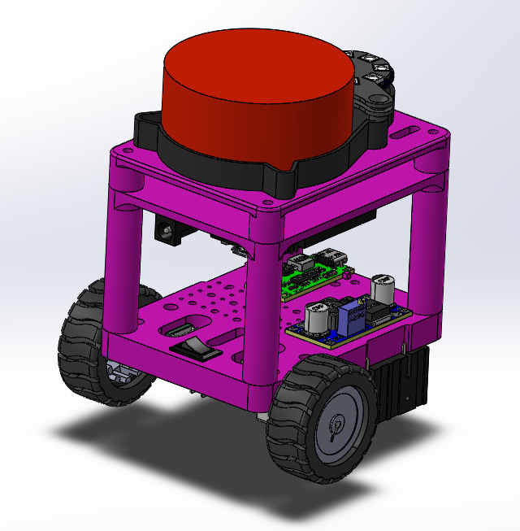

# ROSiK  
**Robot Operating System - interactive Kit**  


Мини-робот на **ESP32 Wroom-32 + ROS 2**, который:
* транслирует одометрию и лидар по Wi-Fi через WebSocket-мост;
* строит карты и локализуется (`slam_toolbox`);
* планирует путь (`nav2`);
* легко расширяется модулями — камера, IMU, динамик, адресные LED, OLED-дисплей.

Работает **на любой машине**: чистая Ubuntu 24.04, WSL 2 под Windows или виртуалка — нужен лишь Wi-Fi.

Инструкция по установке [Ubuntu](https://stepik.org/lesson/1505338/step/1?unit=1525484), [WSL](https://stepik.org/lesson/1505339/step/4?unit=1525485), а также  [запуску графический приложений (RVIZ)](https://stepik.org/lesson/1505339/step/5?unit=1525485).


## 📑 Содержание
1. [Настройка и использования NAV2](#настройка-и-использование-nav2)
2. [Аппаратная часть (BOM)](#аппаратная-часть-bom)  
3. [Электрическая схема](#электрическая-схема)  
4. [3D-модели и сборка](#3d-модели-и-сборка)  
5. [Прошивка ESP32](#прошивка-esp32)
6. [Настройка PID и тестирование](#настройка-pid)
7. [Установка нод в ROS2](#установка-по-на-пк)  
8. [Запуск ROS 2-нод](#запуск-ros-2-нод)  
9. [Контакты](#контакты)


# Документация по использованию навигации Nav2 на мини-роботах с ESP32 (ROSik)
Введение
В последние годы мини-роботы, такие как ROSik, на базе ESP32 становятся все более популярными в области робототехники и автоматизации. Одной из ключевых задач, стоящих перед такими устройствами, является навигация. В этой документации мы рассмотрим использование системы навигации Nav2 (Navigation 2) в контексте мини-роботов на базе ESP32.


https://github.com/user-attachments/assets/f576a6a0-ff34-416d-91f0-c3dbf9222eb7


# 1. Обзор ESP32
ESP32 — это мощный микроконтроллер с поддержкой Wi-Fi и Bluetooth, который идеально подходит для создания IoT-устройств и робототехники. Он обладает следующими характеристиками:

Двухъядерный процессор с тактовой частотой до 240 МГц
520 КБ SRAM
Поддержка различных интерфейсов (I2C, SPI, UART и др.)
Встроенные модули Wi-Fi и Bluetooth
<a id="настройка-и-использование-nav2">настройка-и-использование-nav2</a> 
# 2. Что такое Nav2?
Nav2 — это система навигации для роботов, разработанная в рамках проекта Robot Operating System (ROS). Она предоставляет инструменты для:

Построения карты окружающей среды
Определения местоположения робота
Планирования маршрутов
Управления движением
Nav2 включает в себя несколько ключевых компонентов:


Сенсоры: для сбора данных об окружающей среде
Алгоритмы локализации: для определения положения робота
Планировщики маршрутов: для нахождения оптимального пути
Контроллеры движения: для управления движением робота
# 3. Установка и настройка
# 3.1. Установка ROS 2
Для работы с Nav2 необходимо установить ROS 2. Следуйте инструкциям на официальном сайте ROS 2 для вашей операционной системы.

# 3.2. Установка Nav2
После установки ROS 2 выполните следующие команды для установки Nav2:

bash


https://github.com/user-attachments/assets/7ac4b358-6e9d-49da-b2c6-dd11fbe53735


Run
Copy code
sudo apt update
sudo apt install ros-<distro>-navigation2 ros-<distro>-nav2-bringup
Замените <distro> на вашу версию ROS 2 (например, foxy).

Собственно код:
```yaml
bt_navigator:
  ros__parameters:
    global_frame: map
    robot_base_frame: base_link
    odom_topic: /odom
    bt_loop_duration: 10
    default_server_timeout: 20
    wait_for_service_timeout: 1000
    action_server_result_timeout: 900.0
    navigators: ["navigate_to_pose", "navigate_through_poses"]
    navigate_to_pose:
      plugin: "nav2_bt_navigator::NavigateToPoseNavigator"
    navigate_through_poses:
      plugin: "nav2_bt_navigator::NavigateThroughPosesNavigator"
    error_code_names:
      - compute_path_error_code
      - follow_path_error_code

controller_server:
  ros__parameters:
    controller_plugins: ["FollowPath"]
    FollowPath:
      plugin: "nav2_regulated_pure_pursuit_controller::RegulatedPurePursuitController"
      lookahead_dist:           0.15
      use_path_orientations:    false
      use_rotate_to_heading:    false

      # --- скорость ---
      desired_linear_vel:       0.08         # м/с
      max_robot_angular_vel:    1.8          # рад/с
      max_angular_accel:        2.0          # рад/с²
      use_velocity_scaled_lookahead_dist: true
      regulate_turning_velocity: true
      
      # — коллизии и замедление —
      use_collision_detection:             true
      max_allowed_time_to_collision_up_to_carrot: 2.0
      cost_scaling_dist:                   0.05   # ≤ inflation_radius
      inflation_cost_scaling_factor:       3.0    # = costmap
      use_cost_regulated_linear_velocity_scaling: true
      use_regulated_linear_velocity_scaling:       true
      
   


local_costmap:
  local_costmap:
    ros__parameters:
      update_frequency: 5.0
      publish_frequency: 2.0
      global_frame: odom
      robot_base_frame: base_link
      rolling_window: true
      width: 3
      height: 3
      resolution: 0.03
      #robot_radius: 0.06
      footprint: "[[0.05, 0.05], [0.05, -0.05], [-0.05, -0.05], [-0.05, 0.05]]"
      footprint_padding: 0.01
      plugins: ["voxel_layer", "inflation_layer"]
      inflation_layer:
        plugin: "nav2_costmap_2d::InflationLayer"
        cost_scaling_factor: 4.0
        inflation_radius: 0.12
        inflation_cost_scaling_factor: 4.0
      voxel_layer:
        plugin: "nav2_costmap_2d::VoxelLayer"
        enabled: True
        publish_voxel_map: True
        origin_z: 0.0
        z_resolution: 0.05
        z_voxels: 16
        max_obstacle_height: 2.0
        mark_threshold: 0
        observation_sources: scan
        scan:
          topic: /scan
          max_obstacle_height: 2.0
          clearing: True
          marking: True
          data_type: "LaserScan"
          raytrace_max_range: 3.0
          raytrace_min_range: 0.0
          obstacle_max_range: 2.5
          obstacle_min_range: 0.0
      static_layer:
        plugin: "nav2_costmap_2d::StaticLayer"
        map_subscribe_transient_local: True
      always_send_full_costmap: True

global_costmap:
  global_costmap:
    ros__parameters:
      update_frequency: 1.0
      publish_frequency: 1.0
      global_frame: map
      robot_base_frame: base_link
      #robot_radius: 0.06
      footprint: "[[0.05, 0.05], [0.05, -0.05], [-0.05, -0.05], [-0.05, 0.05]]"
      footprint_padding: 0.01
      resolution: 0.05
      track_unknown_space: true
      plugins: ["static_layer", "obstacle_layer", "inflation_layer"]
      obstacle_layer:
        plugin: "nav2_costmap_2d::ObstacleLayer"
        enabled: True
        observation_sources: scan
        scan:
          topic: /scan
          max_obstacle_height: 2.0
          clearing: True
          marking: True
          data_type: "LaserScan"
          raytrace_max_range: 3.0
          raytrace_min_range: 0.0
          obstacle_max_range: 2.5
          obstacle_min_range: 0.0
      static_layer:
        plugin: "nav2_costmap_2d::StaticLayer"
        map_subscribe_transient_local: True
      inflation_layer:
        plugin: "nav2_costmap_2d::InflationLayer"
        cost_scaling_factor: 4.0
        inflation_radius: 0.12
        inflation_cost_scaling_factor: 4.0
      always_send_full_costmap: True


map_saver:
  ros__parameters:
    save_map_timeout: 5.0
    free_thresh_default: 0.25
    occupied_thresh_default: 0.65
    map_subscribe_transient_local: True

planner_server:
  ros__parameters:
    expected_planner_frequency: 20.0
    planner_plugins: ["GridBased"]
    costmap_update_timeout: 1.0
    GridBased:
      plugin: "nav2_navfn_planner::NavfnPlanner"
      tolerance: 0.5
      use_astar: false
      allow_unknown: true

smoother_server:
  ros__parameters:
    smoother_plugins: ["simple_smoother"]
    simple_smoother:
      plugin: "nav2_smoother::SimpleSmoother"
      tolerance: 1.0e-10
      max_its: 1000
      do_refinement: True

behavior_server:
  ros__parameters:
    local_costmap_topic: local_costmap/costmap_raw
    global_costmap_topic: global_costmap/costmap_raw
    local_footprint_topic: local_costmap/published_footprint
    global_footprint_topic: global_costmap/published_footprint
    cycle_frequency: 10.0
    behavior_plugins: ["spin", "backup", "drive_on_heading", "assisted_teleop", "wait"]
    spin:
      plugin: "nav2_behaviors::Spin"
    backup:
      plugin: "nav2_behaviors::BackUp"
    drive_on_heading:
      plugin: "nav2_behaviors::DriveOnHeading"
    wait:
      plugin: "nav2_behaviors::Wait"
    assisted_teleop:
      plugin: "nav2_behaviors::AssistedTeleop"
    local_frame: odom
    global_frame: map
    robot_base_frame: base_link
    transform_tolerance: 0.1
    simulate_ahead_time: 2.0
    max_rotational_vel: 1.0
    min_rotational_vel: 0.4
    rotational_acc_lim: 3.2

waypoint_follower:
  ros__parameters:
    loop_rate: 20
    stop_on_failure: false
    action_server_result_timeout: 900.0
    waypoint_task_executor_plugin: "wait_at_waypoint"
    wait_at_waypoint:
      plugin: "nav2_waypoint_follower::WaitAtWaypoint"
      enabled: True
      waypoint_pause_duration: 200

velocity_smoother:
  ros__parameters:
    enabled: false
    smoothing_frequency: 20.0
    scale_velocities: False
    feedback: "OPEN_LOOP"
    max_velocity: [0.5, 0.0, 2.0]
    min_velocity: [-0.5, 0.0, -2.0]
    max_accel: [2.5, 0.0, 3.2]
    max_decel: [-2.5, 0.0, -3.2]
    odom_topic: "odom"
    odom_duration: 0.1
    deadband_velocity: [0.0, 0.0, 0.0]
    velocity_timeout: 1.0

collision_monitor:
  ros__parameters:
    base_frame_id: "base_link"
    odom_frame_id: "odom"
    cmd_vel_in_topic: "cmd_vel_smoothed"
    cmd_vel_out_topic: "cmd_vel"
    state_topic: "collision_monitor_state"
    transform_tolerance: 0.2
    source_timeout: 1.0
    base_shift_correction: True
    stop_pub_timeout: 2.0
    # Polygons represent zone around the robot for "stop", "slowdown" and "limit" action types,
    # and robot footprint for "approach" action type.
    polygons: ["FootprintApproach"]
    FootprintApproach:
      type: "polygon"
      action_type: "approach"
      footprint_topic: "/local_costmap/published_footprint"
      time_before_collision: 1.2
      simulation_time_step: 0.1
      min_points: 6
      visualize: False
      enabled: false
    observation_sources: ["scan"]
    scan:
      type: "scan"
      topic: "scan"
      min_height: 0.0
      max_height: 2.0
      enabled: True

docking_server:
  ros__parameters:
    controller_frequency: 50.0
    initial_perception_timeout: 5.0
    wait_charge_timeout: 5.0
    dock_approach_timeout: 30.0
    undock_linear_tolerance: 0.05
    undock_angular_tolerance: 0.1
    max_retries: 3
    base_frame: "base_link"
    fixed_frame: "odom"
    dock_backwards: false
    dock_prestaging_tolerance: 0.5

    # Types of docks
    dock_plugins: ['simple_charging_dock']
    simple_charging_dock:
      plugin: 'opennav_docking::SimpleChargingDock'
      docking_threshold: 0.05
      staging_x_offset: -0.7
      use_external_detection_pose: true
      use_battery_status: false # true
      use_stall_detection: false # true

      external_detection_timeout: 1.0
      external_detection_translation_x: -0.18
      external_detection_translation_y: 0.0
      external_detection_rotation_roll: -1.57
      external_detection_rotation_pitch: -1.57
      external_detection_rotation_yaw: 0.0
      filter_coef: 0.1

    controller:
      k_phi: 3.0
      k_delta: 2.0
      v_linear_min: 0.15
      v_linear_max: 0.15
      use_collision_detection: true
      costmap_topic: "local_costmap/costmap_raw"
      footprint_topic: "local_costmap/published_footprint"
      transform_tolerance: 0.1
      projection_time: 5.0
      simulation_step: 0.1
      dock_collision_threshold: 0.3

loopback_simulator:
  ros__parameters:
    base_frame_id: "base_link"
    odom_frame_id: "odom"
    map_frame_id: "map"
    scan_frame_id: "base_scan"  # tb4_loopback_simulator.launch.py remaps to 'rplidar_link'
    update_duration: 0.02
```

    
# 3.3. Настройка ESP32
Для работы с ESP32 вам потребуется установить платформу Arduino или ESP-IDF. Убедитесь, что у вас установлены необходимые библиотеки для работы с ROS 2.

# 4. Интеграция Nav2 с ESP32
# 4.1. Подключение сенсоров
Для успешной навигации необходимо подключить сенсоры, такие как LIDAR или ультразвуковые датчики, к ESP32. Эти сенсоры будут использоваться для сбора данных об окружающей среде.

# 4.2. Настройка локализации
Используйте алгоритмы локализации, такие как AMCL (Adaptive Monte Carlo Localization), для определения положения робота на карте. Настройте параметры AMCL в конфигурационных файлах Nav2.

# 4.3. Планирование маршрутов
Настройте планировщик маршрутов в Nav2, чтобы он мог находить оптимальные пути. Вы можете использовать различные алгоритмы, такие как Dijkstra или A*, в зависимости от ваших требований.

# 4.4. Управление движением
Используйте контроллеры движения, такие как DifferentialController, для управления движением робота. Настройте параметры контроллера в конфигурационных файлах Nav2.

# 5. Примеры использования
# 5.1. Пример 1: Автономная навигация
Создайте проект, в котором робот будет автономно перемещаться по заданной карте, избегая препятствий. Используйте сенсоры для сбора данных и Nav2 для планирования маршрутов.

# 5.2. Пример 2: Управление через Wi-Fi
Настройте ESP32 для управления роботом через Wi-Fi. Используйте ROS 2 для отправки команд на движение и получения данных о состоянии робота.


https://github.com/user-attachments/assets/c701445e-02ee-4eca-a5b4-07d5c57ce9de

# 6. Заключение
Использование Nav2 на мини-роботах с ESP32, таких как ROSik, открывает новые горизонты в области автономной навигации. С помощью этой документации вы сможете настроить и интегрировать систему навигации в ваш проект, что позволит вашему роботу эффективно перемещаться и взаимодействовать с окружающей средой.

# 7. Ресурсы
Официальная документация ROS 2
Документация Nav2
ESP32 Documentation
Эта документация является основой для начала работы с навигацией на мини-роботах с ESP32. Вы можете расширять и адаптировать ее в зависимости от ваших потребностей и проектов.


## 🛒<a id="аппаратная-часть-bom">Аппаратная часть (BOM)</a>

* | 1 | **ESP32 Wroom-32 DevKit**         | https://aliexpress.ru/item/1005006697750568.html
* | 2 | DC-мотор N20 60 RPM + энкодер     | https://aliexpress.ru/item/1005007145668771.html
* | 3 | Драйвер моторов ZK-5AD            | https://aliexpress.ru/item/1005005798367960.html
* | 4 | Лидар                             | https://aliexpress.ru/item/1005008371059417.html
* | 5 | Аккумулятор 18650 × 2 + держатель | https://aliexpress.ru/item/1005005447141518.html
* | 6 | Понижающий DC-DC                  | https://aliexpress.ru/item/32896699470.html
* | 7 | Переключатель питания             | https://aliexpress.ru/item/4000973563250.html
* | 8 | Type-C зарядка  2S 1A             | https://aliexpress.ru/item/1005006628986640.html


---

## 🔌 <a id="электрическая-схема">Электрическая схема</a>

Файл CorelDraw **`/Scheme/ROSik_scheme.cdr`**  
а также PNG **`/Scheme/scheme.png`**.  
В схеме показаны соединения питания (8,4 V → 5 V), сигнальные линии к драйверу моторов, энкодерам, лидару (UART)  


---

## 🖨 <a id="3d-модели-и-сборка">3D-модели и сборка</a>

Каталог **`/3D`** содержит файлы SolidWorks (`.SLDPRT/.SLDASM`) и готовые `.STL` для печати.


* | `00 - WheelLayer.*`    | Нижняя плита с моторами 
* | `01 - LidarLayer.*`    | Верхняя плита под лидар 
* | `10 - ESPLayer.*`      | Средняя плита под ESP32 и драйвер 
* | `Bracket.* / Holder.*` | Крепёж моторов, DC-DC и т.п. 
* | `RosikAssambl.SLDASM`  | Полная сборка 
* | `STL/`                 | Файлы для печати (0,2 мм, PLA) 
* | `ROSik.png`            | Рендер итогового вида 

Собирать снизу → вверх, фиксируя слои стойками M3 × 20 мм. Проводку прячем во внутреннем объеме робота.

---

## 🔥<a id="прошивка-esp32"> Прошивка ESP32 </a>

### Требуемые библиотеки (Arduino IDE)

* Скопируйте ZIP-файлы из `/esp32_libraries/` в `Documents/Arduino/libraries`  
* Добавьте плату ESP32: `File → Preferences → Additional URL` → `https://raw.githubusercontent.com/espressif/arduino-esp32/gh-pages/package_esp32_index.json`
* Через Board Manager добавьте ESP32

### Шаги прошивки

1. Откройте **`/esp32_firmware/esp32_firmware.ino`** в Arduino IDE.  
2. Измените SSID и пароль Wi-Fi сети.  
3. Порт: `Tools → Port → /dev/ttyUSB?` (или COM\*)
4. Плата: `ESP32 Wroom DA Module`
5. Загрузка `Ctrl + U`.  
6. После рестарта ESP32 печатает IP-адрес в Serial Monitor. Скорость: `115200 baud`.

> Прошивка для ESP32_cam (`/esp32_cam/firmware/firmware.ino`) 

---

## <a id="настройка-pid">Настройка PID и тестирование робота</a>

### Утилита позволив вам подобрать коэффициенты PID - регулятора и приверить его работу


* Измените IP адрес
* Проверьте работу одометрии и управления роботом
* Подберите коэффициенты и измените их в прошивке робота

---

## 🐧 Установка Ноды в ROS2

```bash
# 1. Создаём рабочую директорию
mkdir -p ~/ros2_ws/src && cd ~/ros2_ws/src

# 2. Копируем esp32_bridge в ~/ros2_ws/src

# 3. Сборка
cd ~/ros2_ws
colcon build
source install/setup.bash

````

* Все конфиги лежат в директории `esp32_bridge\config`. При запуске исправить пути к конфигам на актуальные
* протестировано на **ROS 2 Jazzy** (Ubuntu 24.04)
* в **WSL 2** нужен X-server (XLaunch) для RViz 2

---

## 🚀<a id="запуск-ros-2-нод"> Запуск ROS 2-нод </a>

| Шаг | Команда                                                                                                                     | Описание            |
| --- | --------------------------------------------------------------------------------------------------------------------------- | ------------------- |
| 1   | `ros2 run esp32_bridge esp32_bridge --ros-args -p host:=<IP_ESP32> `                                                        | WebSocket-мост      |
| 2   | `rviz2`  → `File → Open Config` → `config/rviz/rosik.rviz`                                                                  | Визуализация данных |
| 3   | `ros2 launch slam_toolbox online_sync_launch.py slam_params_file:=~/ros2_ws/src/esp32_bridge/config/slam_param.yaml`        | Онлайн SLAM         |
| 4   | `ros2 run teleop_twist_keyboard teleop_twist_keyboard`                                                                      | Телеуправление      |
| 5   | `ros2 service call /slam_toolbox/serialize_map slam_toolbox/srv/SerializePoseGraph "{filename: '~/ros2_ws/maps/my_map'}"`   | Сохранить карту     |
| 6   | `ros2 launch slam_toolbox localization_launch.py slam_params_file:=~/ros2_ws/src/esp32_bridge/config/slam_localization.yaml`| Локализация         |
| 7   | `ros2 launch nav2_bringup navigation_launch.py params_file:=~/ros2_ws/src/esp32_bridge/config/nav_param.yaml`               | Навигация `nav2`    |

> **WSL 2**: перед запуском RViz 2<br>
> `export DISPLAY=$(ip route | awk '/default/ {print $3}'):0.0` или
> `export DISPLAY=xxx.xxx.xxx.xxx:0.0`

Настройки RVIZ в файле `esp32_bridge/config/rviz.rviz`


## GIF - демонстрация движения в автономном режиме


---
<a id="контакты">Контакты</a>
* Telegram: **[@burmistrov\_robotics](https://t.me/burmistrov_robotics)**
* Stepik- Народный курс по ROS2: [https://stepik.org/course/221157](https://stepik.org/course/221157)

---

